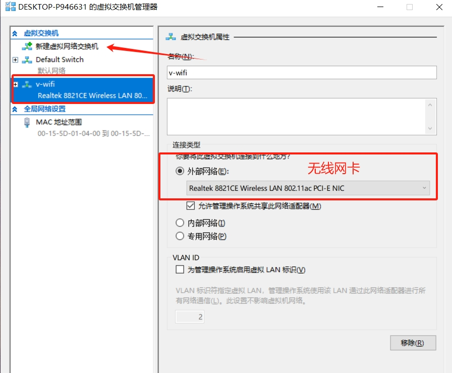

### multipass <!-- {docsify-ignore-all} -->

```bash
multipass launch -n herouu -c 2 -d 50G -m 3G 20.04
```

* 修改静态ip

sudo nano /etc/netplan/50-cloud-init.yaml

```yaml
network:
  ethernets:
    eth0:
      dhcp4: no
      addresses: [ 172.25.192.10/24 ]
      optional: true
      routes:
        - to: default
          via: 172.25.192.1
      nameservers:
        addresses: [ 223.5.5.5,223.6.6.6 ]
      match:
        macaddress: 52:54:00:2b:52:ee
      set-name: eth0
  version: 2
```

修改静态ip后,multipass shell连接不上,是host映射匹配不上，修改C:\Windows\System32\drivers\etc\hosts.ics文件中的ip映射关系，如
`172.25.192.10 vm01.mshome.net`

#### multipass设置桥接网络



* `multipass networks`

```
Name             Type       Description
Default Switch   switch     Virtual Switch with internal networking
hello            ethernet   Realtek PCIe GbE Family Controller


Name             Type       Description
Default Switch   switch     Virtual Switch with internal networking
hello            ethernet   Realtek PCIe GbE Family Controller
v-wifi           switch     Virtual Switch with external networking
``` 

* `multipass set local.bridged-network=v-wifi`

#### 查看multipass配置

```shell
multipass get --keys
multipass get local.bridged-network
```

#### multipass设置镜像源

`multipass set local.image.mirror=https://mirrors.cloud.tencent.com/ubuntu-cloud-images/`