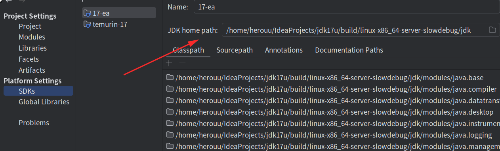
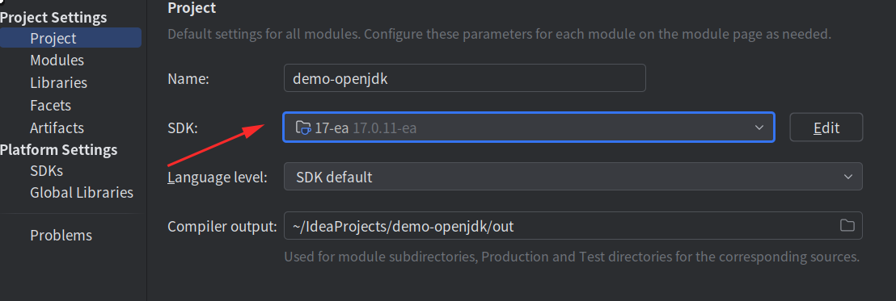
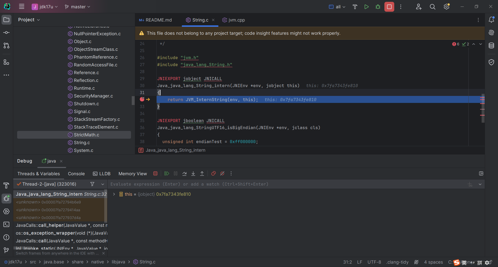
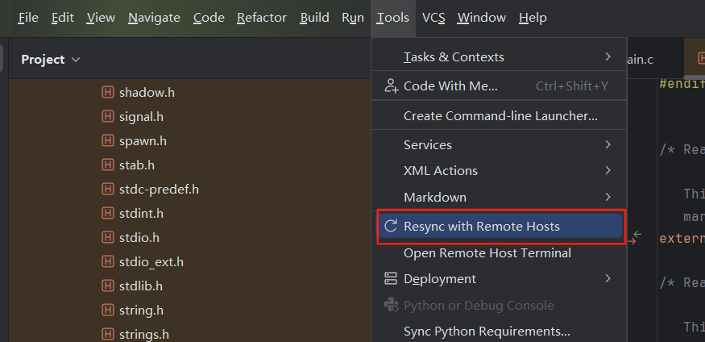

### 源码 <!-- {docsify-ignore-all} -->
 https://github.com/adoptium/jdk17u.git

### clion
导入jdk17u源码

### 编译
```bash

# 在终端中切换至源码目录（即有configure文件存在的目录),出错根据提示解决，一般是依赖错误
bash configure --with-debug-level=slowdebug --with-jvm-variants=server --disable-warnings-as-errors

make clean
make

# Finished building target 'default (exploded-image)' in configuration 'linux-x86_64-server-slowdebug' 编译完成

```

### 编译验证
```bash
cd ./build/linux-x86_64-server-slowdebug/jdk/bin/ && ./java -version

```

```log
openjdk version "17.0.11-internal" 2024-04-16
OpenJDK Runtime Environment (slowdebug build 17.0.11-internal+0-adhoc.herouu.jdk17u)
OpenJDK 64-Bit Server VM (slowdebug build 17.0.11-internal+0-adhoc.herouu.jdk17u, mixed mode)
```


### idea 

jdk指定为编译的版本,并在工程中使用





### 使用String.intern()验证

```java
public class Main {
    public static void main(String[] args) {
        String name = ManagementFactory.getRuntimeMXBean().getName();
        String pid = name.split("@")[0];
        System.out.println("pid：" + pid);
        // 此处断点，然后在clion中点击Run -> Attach to Process 选择pid对应的进程
        // 找到jdk源码中对应的native方法 src/java.base/share/native/libjava/String.c中java_java_lang_String_intern断点,然后调试
        String intern = "123".intern();
        System.out.println(intern);
    }
}
```
### 效果


参考：[一、编译及调试OpenJDK18](https://lauloon9.tech/2022/04/02/jvm/%E4%B8%80%E3%80%81%E7%BC%96%E8%AF%91%E5%8F%8A%E8%B0%83%E8%AF%95OpenJDK18/)


### 使用远程环境开发c代码

* 解决头文件找不到的问题
