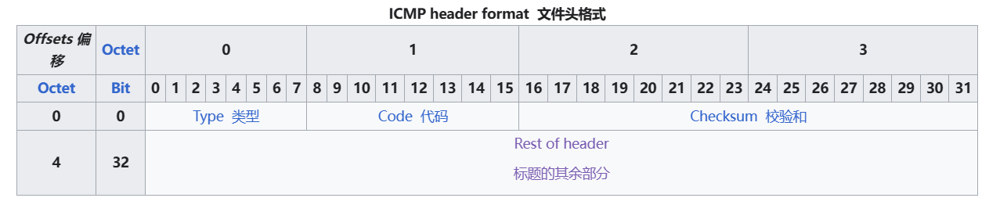
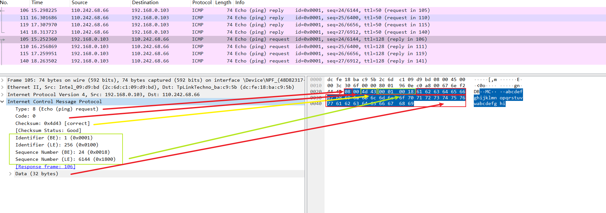

* 使用wireshark分析网络包

```vim
（1）Frame（物理层）: 物理层的数据帧概况
（2）Ethernet II（链路层）: 数据链路层以太网帧头部信息
（3）Internet Protocol Version 4（网络层）: 互联网层IP包头部信息
（4）Transmission Control Protocol（传输层）: 传输层T的数据段头部信息，此处是TCP
（5）Hypertext Transfer Protocol（应用层）: 应用层的信息，此处是HTTP协议

tcp/ip 5层协议
```

### ping命令抓包分析

* ICMP报文格式



* wireshark



wireshark报文内容与ICMP报文格式一一对应

参考: <https://en.wikipedia.org/wiki/Internet_Control_Message_Protocol>

### 协议逆向分析

todo
