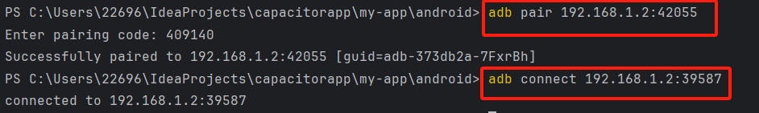
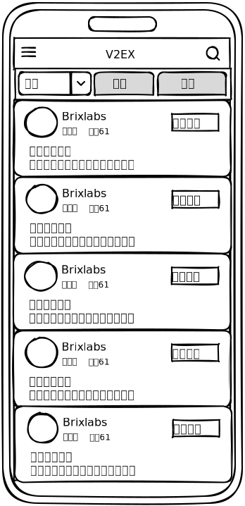
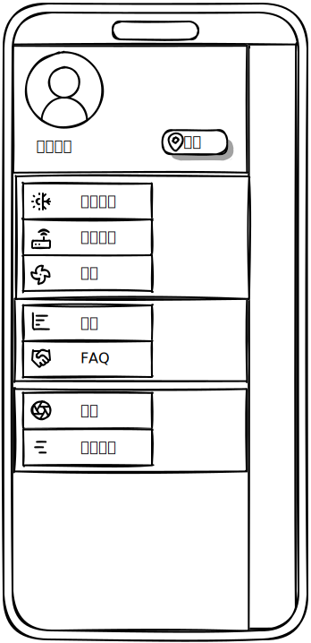

### 跨平台技术的由来 <!-- {docsify-ignore-all} -->

1.
动态化内容需求增大。当需求发生变化时，纯原生应用需要通过版本升级来更新内容，但应用上架、审核是需要周期的，这个周期对高速变化的互联网时代来说是很难接受的，所以，对应用动态化 (
不发版也可以更新应用内容) 的需求就变得迫在眉睫了。
2. 业务需求变化快，开发成本变大。由于原生开发一般都要维护 Android、iOS 两个开发团队，版本迭代时，无论人力成本还是测试成本都会变大。

### 跨平台技术简介

这里的跨平台主要是指移动端跨平台（ios,android），根据原理，主要可分为如下三类。

1. H5(HTML5)+ 原生 ( cordova、**ionic capacitor**)。
2. javascript 开发 + 原生渲染 ( React Native)。
3. 自绘 UI+原生 ( QT Mobile、 **Flutter**、Kotlin Multiplatform)。

### [capacitor](https://capacitorjs.com/docs/getting-started)

#### 初始化

```shell


# 初始化
# Create a new Capacitor app
npm init @capacitor/app

# Or add Capacitor to your web app
# A package.json file
# A separate directory for built web assets such as dist or www
# An index.html file at the root of your web assets directory

npm i @capacitor/core
npm i -D @capacitor/cli
npx cap init


# 安装平台

npm install @capacitor/android # @capacitor/ios

npx cap add android
npx cap sync
npx cap open android

# 运行
# Running on the Command-Line
npx cap run android
# Running with Android Studio

```

#### capacitor关闭android橡皮筋（android rubber band）效果

```java


public class MainActivity extends BridgeActivity {


    @Override
    public void onCreate(Bundle savedInstanceState) {
        super.onCreate(savedInstanceState);
    }

    @Override
    public void onStart() {
        super.onStart();
        WebView webview = getBridge().getWebView();
        webview.setOverScrollMode(WebView.OVER_SCROLL_NEVER);
    }
}
```

#### android调试

* wifi连接
  手机开启usb调试、开启无线调试

```shell
adb pair ip:port-for-pair
adb connect ip:port-for-connect
```



* usb连接  
  手机开启usb调试模式,使用数据线连接电脑，点击电脑上的adb图标，点击Connect to device，选择设备即可。
* avd连接  
  打开项目后，从主菜单栏中依次选择 View > Tool Windows > Device Manager，然后点击 +，再点击 Create Virtual Device
  使用木木模拟器`adb connnet localhost:16384`

#### 移动端模板

https://github.com/easy-temps/vue3-vant-mobile.git

#### 应用内测分发

* github
* https://www.upload-apk.com
* https://www.diawi.com
* 蒲公英

#### v2ex客户端vue实现版

##### 手绘风格设计稿

https://frame0.app/

* 主页
  
* 设置页
  

#### android布局检查器

https://github.com/Grigory-Rylov/android-layout-inspector


#### 根据图生成代码

https://v0.dev/

### flutter 