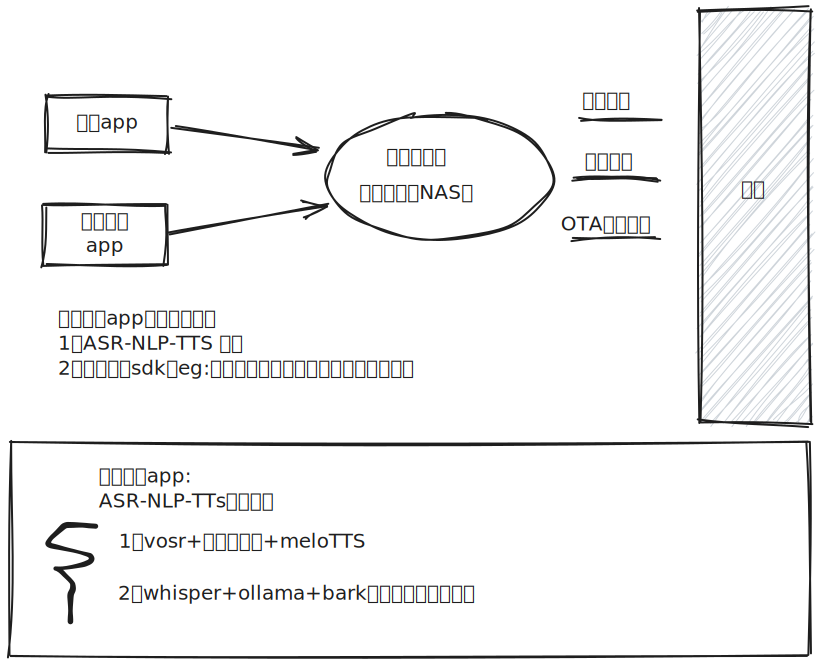

### 物联网架构 <!-- {docsify-ignore-all} -->

* 感知层：识别物体，采集信息 (设备)
* 网络层：主要实现信息的传递；(iot gateway + 物联网协议 such as Modbus、MQTT、IEC104)
  > What is an IoT gateway?  
  > An internet of things (IoT) gateway is a physical device or software program that serves as the connection point
  between the cloud and IoT devices, such as controllers, sensors and smart devices.

* 平台层：对设备进行通讯运营管理(namely 指令下发、指标上送、OTA)
  > [ThingsBoard](https://github.com/thingsboard/thingsboard)
* 应用层：提供丰富的基于物联网的应用

参考：[【从产品设计角度，解读物联网四层架构】](https://www.woshipm.com/pd/4336597.html)

### 应用场景

* 共享充电宝
* 智能音箱
* 智能家居
* 智能媒体屏
* 智能农业设备
* 智能停车场
* 智慧医疗
* 工业流水线设备控制

参考：[【阿里云物联网平台-应用场景】](https://help.aliyun.com/zh/iot/product-overview/common-scenarios)

### 智能家居

#### 智能家居本地化

见帖[【经过米家崩溃，想和大家讨论一下智能家居本地化的可能性】](https://v2ex.com/t/860266)

#### 米家平台

* 小爱音箱（相当于智能家居中控, 需要连接互联网，断网，功能变鸡肋）
* 智能设备(开关、多模态网关、灯)

#### HomeAssistant

* 多物联网平台集成（米家、HomeKit、ESP[diy智能家居.excalidraw](..%2F..%2F..%2F..%2FDocuments%2Fdiy%D6%C7%C4%DC%BC%D2%BE%D3.excalidraw)）

- Bilibili>>aid=367712632&bvid=BV1h94y1w7oN&cid=1378297337
- Youtube>>-u8Rawz6SlI?si=ahJIlYq8pwVs5f3V
- Youtube>>GayRDCOkTqI?si=NQgP0h-wbUCr6wtK

#### diy智能家居平台

### 工业与物联网调试工具
https://www.redisant.cn/