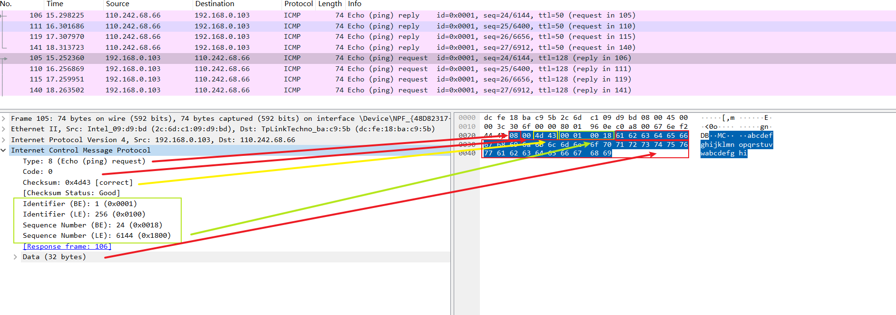

* 使用wireshark分析网络包 

```vim
（1）Frame（物理层）: 物理层的数据帧概况
（2）Ethernet II（链路层）: 数据链路层以太网帧头部信息
（3）Internet Protocol Version 4（网络层）: 互联网层IP包头部信息
（4）Transmission Control Protocol（传输层）: 传输层T的数据段头部信息，此处是TCP
（5）Hypertext Transfer Protocol（应用层）: 应用层的信息，此处是HTTP协议

tcp/ip 5层协议
```

### ping命令抓包分析 <!-- {docsify-ignore-all} -->

* ICMP报文格式


* wireshark



wireshark报文内容与ICMP报文格式一一对应

参考: <https://en.wikipedia.org/wiki/Internet_Control_Message_Protocol>

### 协议逆向分析

todo

### 你管这破玩意儿叫网络 

<iframe width="560" height="315" src="//player.bilibili.com/player.html?isOutside=true&aid=113736908081464&bvid=BV17x6hYZEzJ&cid=27598655274&p=1&autoplay=0" scrolling="no" border="0" frameborder="no" framespacing="0" allowfullscreen="true"></iframe>

文档: [【你管这破玩意儿叫网络】](https://mp.weixin.qq.com/s/h53E5iClVyBNbN282CV2Lw?poc_token=HOs1emejnJiWP8XnS2C-uWZQD7XrBAZgVH7Y2fXK)

### 网络是怎么变得靠谱的

<iframe width="560" height="315" src="//player.bilibili.com/player.html?isOutside=true&aid=113764221321501&bvid=BV1WT6SYXE2S&cid=27680966128&p=1&autoplay=0" scrolling="no" border="0" frameborder="no" framespacing="0" allowfullscreen="true"></iframe>

### 虚拟专用网与网络地址转换NAT

<iframe width="560" height="315" src="//player.bilibili.com/player.html?isOutside=true&aid=82405967&bvid=BV1SJ411V7mS&cid=140990360&p=1&autoplay=0" scrolling="no" border="0" frameborder="no" framespacing="0" allowfullscreen="true"></iframe>

### 记录片《电子监听、全国断网，棱镜门背后，中国如何从末路狂奔到世界之巅》

* 主要讲ipv4与ipv6之争

<iframe width="560" height="315" src="//player.bilibili.com/player.html?isOutside=true&aid=774467410&bvid=BV1i14y157YV&cid=1314029435&p=1&autoplay=0" scrolling="no" border="0" frameborder="no" framespacing="0" allowfullscreen="true"></iframe>